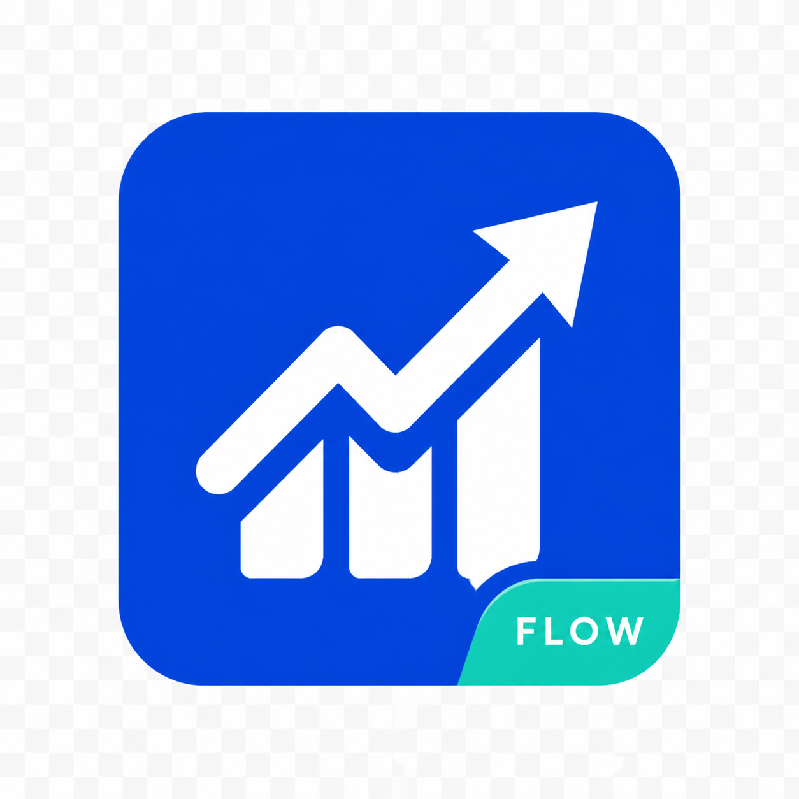

# StockSight Learner

StockSight Learner is a Windows desktop app for people who want to learn market concepts, explore price movements, and build a calmer investing-learning routine.

## Download the app

**[Go to the latest release →](https://github.com/kianjindal2010/stocksight-flow/releases)**

On the Releases page, download the newest `StockSightLearner-Updated.exe` file.

## Install on Windows

1. Download the latest `.exe` from the Releases page.
2. Open your **Downloads** folder and double-click the file.
3. Follow the setup prompts to start StockSight Learner.

Windows may show a security notice for an unsigned app. Before continuing, make sure you downloaded the file from this official GitHub repository. Select **More info**, then **Run anyway** only if you are confident it is the official release.

## Update the app

1. Return to the [Releases page](https://github.com/kianjindal2010/stocksight-flow/releases).
2. Download the newest release when one is available.
3. Run the new file to use the latest version.

## What it helps with

- Learn common market and investing concepts
- Observe market movements in context
- Build a steady learning habit without investment promises

## Important note

StockSight Learner is for educational purposes only. It does not provide investment advice, recommendations, or guarantees of performance. Investing involves risk.

## Need help?

Email [kian.jindal2010@gmail.com](mailto:kian.jindal2010@gmail.com) with a screenshot and a short description of the problem.
