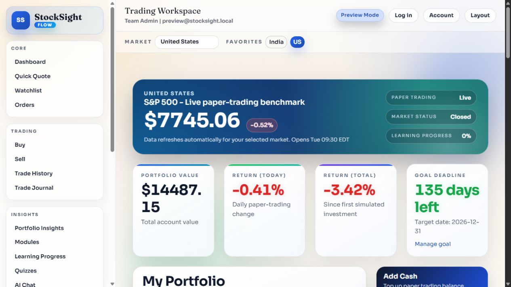
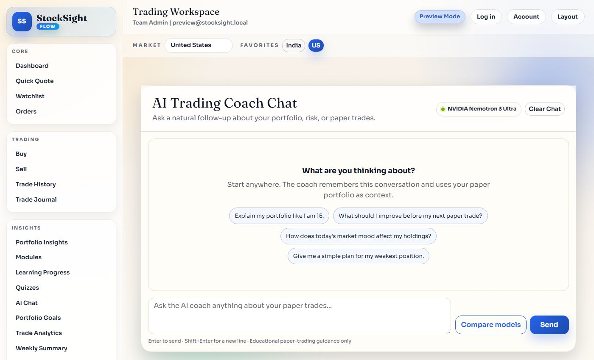
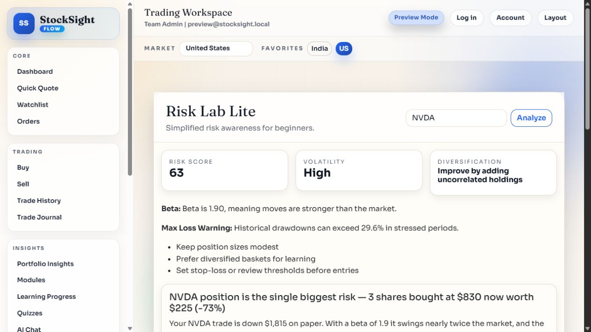

# StockSight Learner

<p align="center">
  
</p>

<p align="center">
  A Windows desktop app for learning market concepts, practising paper trading, and building a calmer investing routine.
</p>

<p align="center">
  <a href="https://github.com/kianjindal2010/stocksight-flow/releases"><strong>Download StockSight Learner for Windows</strong></a>
</p>

> StockSight Learner is for education and paper trading. It does not provide investment advice or guarantee investment results.

## Get the app

1. Open the [official Releases page](https://github.com/kianjindal2010/stocksight-flow/releases).
2. Choose the release marked **Latest**.
3. Download `StockSightLearner-Updated.exe`.
4. Open your **Downloads** folder and double-click the file.

The Releases page is the only official place to download StockSight Learner.

## See the app

| Learning dashboard | AI Trading Coach |
| --- | --- |
|  |  |

| Risk Lab |
| --- |
|  |

StockSight Learner brings together a market workspace, paper-trading tools, learning modules, journals, a Risk Lab, and an AI Trading Coach. The goal is to help you understand your choices before treating anything as a real-money decision.

## Windows security notice

Current releases are unsigned, so Windows may show **“Windows protected your PC”**. This is expected for a new independent app, but you should always verify the file before opening it.

Only continue if all of these are true:

- You downloaded the EXE from this repository's Releases page.
- The file is named `StockSightLearner-Updated.exe`.
- The SHA-256 checksum matches the checksum published for that release.

For the current v1.0.11 release, the SHA-256 checksum is:

```text
8B0C82D2002F7AE0C4CB807EB29F411C3C009CCE280CD05427DCDBC89D3B6B49
```

After verifying it, select **More info**, then **Run anyway** in the Windows notice.

## Updating StockSight Learner

When a new release appears:

1. Return to the [Releases page](https://github.com/kianjindal2010/stocksight-flow/releases).
2. Read the release notes.
3. Download the newest Windows EXE and run it.

Your account and learning data are connected through the app, so you do not need to create a new account just because you update the EXE.

## Need help?

Email [kian.jindal2010@gmail.com](mailto:kian.jindal2010@gmail.com) with:

- A screenshot of the issue
- What you clicked before it happened
- Your Windows version, if you know it

That makes it much easier to help quickly.
